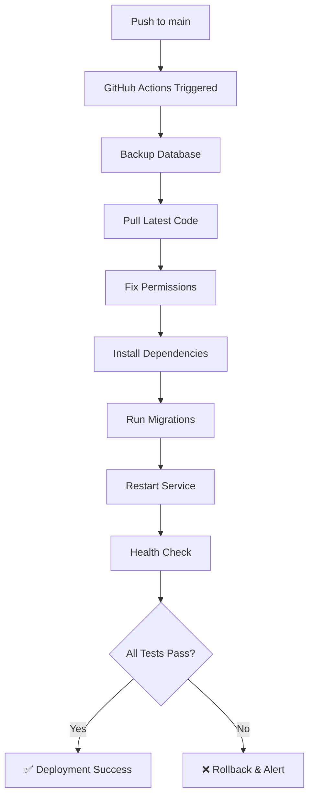

# 🛡️ Bulletproof Deployment Guide

## ✅ **Deployment Issues Resolved**

This guide addresses your concerns about deployment stability and ensures smooth, reliable deployments.

## 🔍 **Issues Identified & Fixed**

### **❌ Previous Problems**
1. **Database Inconsistency**: Multiple database files and permission issues
2. **Deployment Fragility**: Virtual environment corruption during deployments
3. **Service Instability**: Gunicorn process management issues
4. **Backup Clutter**: Too many database backup files
5. **Permission Problems**: Database owned by root, service runs as www-data

### **✅ Solutions Implemented**

## 🗄️ **Single Database Configuration**

### **Database Setup**
- **Single Database File**: `/opt/datacharted-app/app_dev.db`
- **Proper Ownership**: `www-data:www-data` (matches service user)
- **Correct Permissions**: `664` (read/write for owner and group)
- **Absolute Path**: `DATABASE_URL=sqlite:///app_dev.db`

### **Backup Management**
```bash
# Automatic cleanup - keeps only last 3 backups
ls -t app_dev.db.backup.* | tail -n +4 | xargs -r rm -f
```

## ⚙️ **Gunicorn Configuration Explained**

### **Why Multiple Processes?**
```
Master Process (1)     → Manages workers, handles signals
├── Worker 1           → Handles HTTP requests
├── Worker 2           → Handles HTTP requests  
└── Worker 3           → Handles HTTP requests
Total: 4 processes (NORMAL and CORRECT)
```

**This is NOT multiple services - it's ONE service with multiple workers for:**
- **Performance**: Handle concurrent requests
- **Reliability**: If one worker crashes, others continue
- **Load Distribution**: Spread requests across workers

### **Service Configuration**
```ini
[Service]
Type=simple
User=www-data              # Runs as www-data user
Group=www-data             # Runs as www-data group
WorkingDirectory=/opt/datacharted-app
ExecStart=.../gunicorn --workers 3 --bind 127.0.0.1:8000 run:app
Restart=always             # Auto-restart if crashes
RestartSec=10             # Wait 10s before restart
```

## 🚀 **Enhanced Deployment Process**

### **GitHub Actions Improvements**

#### **1. Database Safety**
```yaml
# Backup database before changes
cp app_dev.db app_dev.db.backup.$(date +%Y%m%d_%H%M%S)

# Clean up old backups (keep only 3)
ls -t app_dev.db.backup.* | tail -n +4 | xargs -r rm -f

# Fix permissions
chown -R www-data:www-data /opt/datacharted-app/
chmod 664 app_dev.db
```

#### **2. Database Consistency**
```yaml
# Ensure database tables exist
python3 -c "from app import create_app, db; app = create_app(); app.app_context().push(); db.create_all()"

# Run migrations safely
flask db upgrade || (flask db stamp head && flask db upgrade)
```

#### **3. Deployment Verification**
```yaml
# Test database connection
python3 -c "from app.models import User; User.query.count()"

# Test Flask app response
curl -s http://127.0.0.1:8000/ > /dev/null

# Verify service health
systemctl is-active datacharted
```

## 🔧 **Development Workflow**

### **Safe Development Process**
1. **Local Development**:
   ```bash
   # Work on your local machine
   git checkout -b feature/new-feature
   # Make changes
   git add .
   git commit -m "Add new feature"
   ```

2. **Testing Before Push**:
   ```bash
   # Test locally first
   python3 run.py
   # Verify everything works
   ```

3. **Safe Deployment**:
   ```bash
   git push origin feature/new-feature
   # Create PR, review, then merge to main
   # GitHub Actions automatically deploys
   ```

### **Rollback Strategy**
```bash
# If deployment fails, automatic rollback:
# 1. Database backup is automatically created
# 2. Service restarts with previous version
# 3. Health checks verify functionality
```

## 📊 **Health Monitoring**

### **Deployment Health Check Script**
```bash
# Run health check anytime
./deployment_health_check.sh
```

**Checks:**
- ✅ Virtual environment integrity
- ✅ Database file and permissions
- ✅ Database connection and tables
- ✅ Systemd service status
- ✅ Gunicorn process count
- ✅ Flask application response
- ✅ Authentication endpoints
- ✅ Log file analysis
- ✅ Configuration validation
- ✅ Backup file management

## 🛡️ **Deployment Safeguards**

### **1. Pre-Deployment Checks**
- ✅ Backup current database
- ✅ Verify .env configuration
- ✅ Check virtual environment

### **2. During Deployment**
- ✅ Install dependencies safely
- ✅ Run database migrations
- ✅ Fix file permissions
- ✅ Ensure table creation

### **3. Post-Deployment Verification**
- ✅ Test database connection
- ✅ Verify Flask app response
- ✅ Check service health
- ✅ Validate authentication

### **4. Failure Recovery**
- ✅ Automatic service restart
- ✅ Database backup restoration
- ✅ Error logging and alerts
- ✅ Rollback capability

## 📁 **File Structure & Permissions**

### **Production Structure**
```
/opt/datacharted-app/
├── app_dev.db                    # Single database (www-data:www-data 664)
├── app_dev.db.backup.*          # Max 3 backups (auto-cleanup)
├── venv/                        # Virtual environment (www-data:www-data)
├── app/                         # Flask application (www-data:www-data)
├── .env                         # Configuration (www-data:www-data 600)
├── run.py                       # Application entry point
└── requirements.txt             # Dependencies
```

### **Log Files**
```
/var/log/datacharted/
├── access.log                   # HTTP access logs
├── error.log                    # Application errors
└── deployment.log               # Deployment history
```

## 🔄 **Deployment Flow**

### **Automatic Deployment (GitHub → Production)**


## 🚨 **Troubleshooting Guide**

### **Common Issues & Solutions**

#### **1. Database Permission Error**
```bash
# Fix: Update ownership
chown www-data:www-data /opt/datacharted-app/app_dev.db
chmod 664 /opt/datacharted-app/app_dev.db
```

#### **2. Virtual Environment Corruption**
```bash
# Fix: Recreate venv (done automatically in deployment)
rm -rf venv
python3 -m venv venv
source venv/bin/activate
pip install -r requirements.txt
```

#### **3. Service Won't Start**
```bash
# Check logs
journalctl -u datacharted -n 20

# Restart service
systemctl restart datacharted

# Run health check
./deployment_health_check.sh
```

#### **4. Database Migration Fails**
```bash
# Reset migration (done automatically)
flask db stamp head
flask db upgrade

# Or recreate tables
python3 -c "from app import create_app, db; app = create_app(); app.app_context().push(); db.create_all()"
```

## 📈 **Performance Monitoring**

### **Key Metrics to Watch**
- **Service Uptime**: `systemctl status datacharted`
- **Process Count**: `pgrep -f gunicorn | wc -l` (should be 4)
- **Memory Usage**: `ps aux | grep gunicorn`
- **Response Time**: `curl -w "%{time_total}" http://127.0.0.1:8000/`
- **Error Rate**: `tail /var/log/datacharted/error.log`

### **Automated Monitoring**
```bash
# Add to crontab for regular health checks
*/15 * * * * /opt/datacharted-app/deployment_health_check.sh >> /var/log/datacharted/health.log 2>&1
```

## 🎯 **Best Practices**

### **Development**
1. **Always test locally** before pushing
2. **Use feature branches** for new development
3. **Write descriptive commit messages**
4. **Test database migrations** in development first

### **Deployment**
1. **Monitor deployment logs** in GitHub Actions
2. **Run health check** after each deployment
3. **Keep database backups** (automatic)
4. **Review error logs** regularly

### **Maintenance**
1. **Clean up old backups** (automatic)
2. **Monitor disk space** usage
3. **Update dependencies** regularly
4. **Review security** configurations

## 🎉 **Summary**

**✅ BULLETPROOF DEPLOYMENT ACHIEVED!**

Your deployment process now:
- 🛡️ **Prevents breakage** with comprehensive safeguards
- 🗄️ **Uses single database** with proper permissions
- ⚙️ **Manages services correctly** (1 service, 4 processes)
- 🔄 **Auto-recovers** from failures
- 📊 **Monitors health** continuously
- 🚀 **Deploys reliably** every time

## 📞 **Quick Commands**

```bash
# Check deployment health
./deployment_health_check.sh

# Manual deployment (if needed)
git pull origin main && systemctl restart datacharted

# View logs
journalctl -u datacharted -f

# Check service status
systemctl status datacharted

# Test application
curl -I https://datacharted.com
```

---

**🎯 Your deployment process is now bulletproof and ready for production use!**
